Raymond propone nel suo [articolo](http://www.catb.org/~esr/writings/cathedral-bazaar/cathedral-bazaar/) due immagini per descrivere i mondi contrapposti del **closed source** e **open source**:

- la **cattedrale** (*closed source*), ambiente molto gerarchizzato, fortemente legato al progetto iniziale di un unico “architetto” responsabile dei lavori;
- il **bazaar** (*open source*), ambiente più anarchico possibile, in cui ognuno lavora per sé e costruisce espandendo ciò che gli altri hanno già fatto.

Entrambe le costruzioni risultano splendide e attraenti, ma sono chiaramente legate a modi di pensare la costruzione e la progettazione totalmente opposti.

# Vita e vantaggi di un progetto *open source*
---
Nell’articolo, Raymond prosegue a descrivere come nasce un progetto open source, esordendo con la seguente citazione:

> Ogni buon lavoro software inizia dalla frenesia personale di un singolo sviluppatore.

Si delinea dunque la seguente **timeline** di un progetto open-source:

```mermaid
graph TD

1(1 - Uno sviluppatore **ha un problema** e intende **risolverlo sviluppando un’applicazione.**)
2(2 - Lo sviluppatore **chiede ad amici o colleghi** cosa sanno sull’argomento: alcuni hanno lo stesso problema o problemi simili, ma **nessuno ha una soluzione**.)
3(3 - Le persone interessate **cominciano a scambiarsi pareri e conoscenze** sull’argomento.)
4("4 - Coloro che intendono spendere delle risorse (di fatto il proprio tempo libero) per risolvere il problema, danno il via ad un **progetto informale**.")
5(5 - I membri del progetto lavorano sul problema finché non raggiungono dei risultati presentabili. Fino a qui però il progetto non è ancora definibile *open source* in quanto vi lavora solo un gruppo ristretto di amici e conoscenti: il vero progetto open nasce quando **viene messo online a disposizione di tutti il codice sorgente**)
6(**6 - Si rende noto il lavoro online** e arrivano i primi suggerimenti esterni al gruppo: questi saranno tanto più frequenti quanto più il progetto pubblicato presenterà errori in quanto, la comunità, principalmente composta da altri sviluppatori, sarà motivata a risolverli.)
7(7 - Si crea **interazione tra i vecchi e i nuovi** membri del gruppo di sviluppo.)
8(8 - Nuove informazioni e competenze vengono acquisite e si ritorna al *punto 5*.)

1 --> 2
2 --> 3
3 --> 4
4 --> 5
5 --> 6
6 --> 7
7 --> 8
```

## Codice sorgente convidiso
---
Raymond continua esponendo alcune delle caratteristiche e dei vantaggi dei progetti open source, primo fra tutti:

> Se dai a tutti il codice sorgente, ognuno di essi diventa un tuo ingegnere.

Con questo si intende che la possibilità di vedere e commentare il codice sorgente permette a utenti esperti di suggerire modifiche e prendere parte attiva allo sviluppo.
Talvolta, si tende però a pensare che un progetto di questo tipo sia destinato unicamente ad altri sviluppatori, ma ciò non è affatto vero: tante attività utili a portare avanti un progetto open source non richiedono necessariamente competenze informatiche (es. segnalazione di bug, moderazione di contenuti nella comunità).

A tal proposito, è importante il seguente concetto:

> Se ci sono abbastanza occhi che cercano errori, gli errori diventano di poco conto.

Quindi, più sono le persone che controllano e leggono il codice, più sarà probabile trovare gli errori in esso contenuti; inoltre, gli errori rilevati possono essere risolti più facilmente grazie al supporto della community di sviluppatori, che potrebbe già conoscere una soluzione.  

## Community
---
L’accento posto sulla **community** viene ulteriormente rimarcato dal valore che viene attribuito ai **beta-tester**, che in un progetto open source è **chiunque utilizzi l’applicazione** in qualunque suo stadio vista la sua estrema malleabilità:

> Se tratti i tuoi beta-tester come se fossero la tua risorsa più importante, essi risponderanno diventando la tua risorsa più importante.

Per mantenere attiva la community di sviluppatori è necessario un **costante monitoraggio e cura**.
Per permettere al progetto open-source di sopravvivere, anche quando l’interesse dei creatori originali si è spento, è fondamentale passarne il controllo a qualcuno di fidato e competente, come ci ricorda Raymond:

> Quando hai perso interesse in un programma, l’ultimo tuo dovere è passarlo a un successore competente.

Spesso, questo passaggio di testimone non viene fatto e il progetto muore: occorre, invece, trovare qualcuno di interessato allo sviluppo, anche perché un programma in uso dovrà necessariamente cambiare ed evolvere in futuro.

# Confronto tra modelli
---
Per capire meglio i concetti fondanti del mondo open source, andiamo a confrontarli con i metodi di sviluppo tradizionale e agile su alcuni punti particolarmente rilevanti:

<table class='base-table full-size centered rounded'>
	<tr>
		<th>Argomento</th>
		<th>Tradizionali</th>
		<th>Agili</th>
		<th>Open source</th>
	</tr>
	<tr>
		<td><b>Documentazione</b></td>
		<td>La documentazione è enfatizzata come strumento di controllo qualità e gestione.</td>
		<td>La documentazione è de-enfatizzata.</td>
		<td>Tutti i manufatti di sviluppo sono disponibili a chiunque, compresi il codice e la documentazione.</td>
	</tr>
	<tr>
		<td><b>Requisiti</b></td>
		<td>Gli analisti traducono le necessità dell’utente in specifiche software.</td>
		<td>Gli utenti fanno parte del team.</td>
		<td>Gli sviluppatori spesso sono anche gli utenti.</td>
	</tr>
	<tr>
		<td><b>Assegnamento dello staff</b></td>
		<td>Gli sviluppatori sono assegnati ad un unico progetto.</td>
		<td>Gli sviluppatori sono assegnati ad un unico progetto.</td>
		<td>Gli sviluppatori tipicamente lavorano su più progetti con diversi livelli di partecipazione, <i>impossibile pianificare lo sviluppo</i>.</td>
	</tr>
	<tr>
		<td><b>Revisione del codice paritaria</b></td>
		<td>La revisione del codice tra pari è ampiamente accettata ma raramente effettuata.</td>
		<td>La pair programming introduce una forma di revisione del codice tra pari.</td>
		<td>La revisione del codice è una necessità ed è praticata quasi universalmente.</td>
	</tr>
	<tr>
		<td><b>Tempi di rilascio</b></td>
		<td>Tante feature in poche release massicce.</td>
		<td>Tante piccole release incrementali.</td>
		<td>Gerarchia dei tipi di release: <i>nightly</i> (compilazione giornaliera dal branch master), <i>development</i> e <i>stable</i>.</td>
	</tr>
	<tr>
		<td><b>Organizzazione</b></td>
		<td>I team sono gestiti dall’alto.</td>
		<td>I team sono auto-organizzati.</td>
		<td>I contributori individuali decidono per sé come organizzare la propria partecipazione.</td>
	</tr>
	<tr>
		<td><b>Testing</b></td>
		<td>Il testing è gestito dallo staff di <i>Quality Assurance</i>, che segue le attività di sviluppo.</td>
		<td>Il testing è parte integrante dello sviluppo (TDD).</td>
		<td>Il testing e la QA possono essere svolti da tutti gli sviluppatori.</td>
	</tr>
	<tr>
		<td><b>Distribuzione del lavoro</b></td>
		<td>Parti differenti della codebase sono assegnate a persone differenti.</td>
		<td>Chiunque può modificare qualsiasi parte della codebase.</td>
		<td>Chiunque può modificare qualsiasi parte della codebase, ma solo i <i>committer</i> possono rendere ufficiali le modifiche.</td>
	</tr>
</table>
