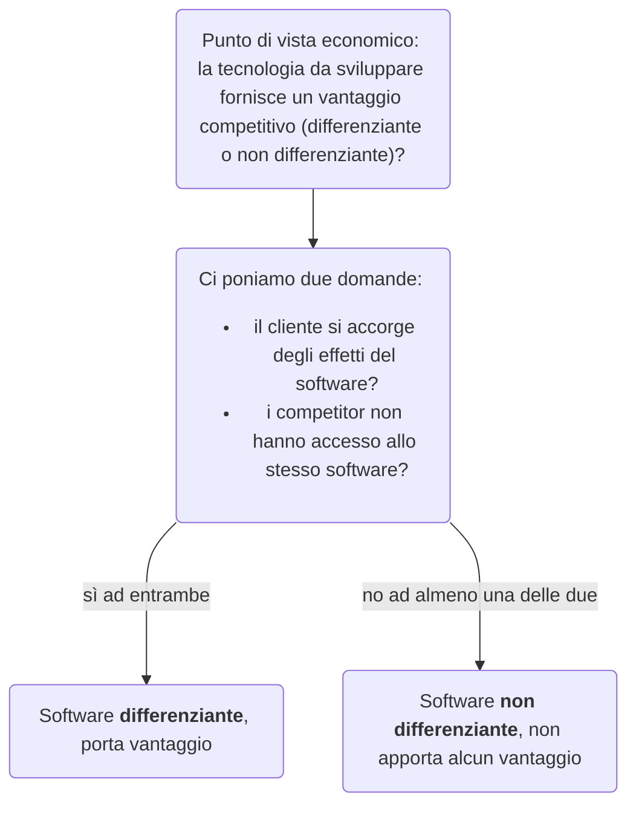

Un'altra domanda che ci si può porre riflettendo sull'idea di software open source è: 

> *Perché sempre più aziende investono in software open source?*

A prima vista, sembrerebbe un controsenso, poiché da sempre i produttori di software proteggono il proprio prodotto tramite segreto aziendale, ed avere codice liberamente consultabile distrugge tale privatezza ed espone all’ascesa di competitor.
Per rispondere a questa domanda ci serviamo di un [articolo](http://web.archive.org/web/20120724095330/http://perens.com/works/articles/Economic.html) di *Bruce Perens* sull’argomento.

Perens fa notare che spesso, per diverse aziende, **il software da sviluppare non è il prodotto**, ma una **tecnologia abilitante essenziale**.
Per esempio: Amazon sviluppa molto software per il sito di e-commerce, ma il suo prodotto non è il sito.
In tali ambiti, la **scrittura di codice è un costo**, **non il prodotto su cui guadagnare**.

# Punto di vista economico
---
Dal punto di vista economico è poi importante stabilire se la tecnologia dà un vantaggio competitivo, ovvero se essa è **differenziante** o **non differenziate**.
Per fare ciò è sufficiente rispondere alle seguenti domande:

- **Il cliente si accorge degli effetti del software?** Per esempio, le persone si accorgono dell’esistenza del sistema di raccomandazione dei libri di Amazon?
- **I competitor non hanno accesso allo stesso software?** Se Amazon usasse il sistema di raccomandazione venduto anche a Feltrinelli allora non avrebbe senso mantenerlo privato.

Perché un software non apporta alcun vantaggio nel caso di no ad una delle due domande?
Perché, a quel punto, è meglio utilizzare un modello di sviluppo open source, poiché sparpaglia i costi e genera valore, in quanto le persone contribuiscono allo sviluppo e al miglioramento del software in modo gratuito, per cui sempre più aziende lo scelgono.

# Confronto diversi modelli di sviluppo
---
Perens conclude il suo articolo riportando una matrice in cui vengono confrontati 4 diversi modelli di sviluppo, ognuno con le sue caratteristiche che ne determinano l’applicabilità in diverse situazioni:

- ***Retail***, il software è sviluppato per poter essere venduto a chiunque lo desideri;
- ***In-House & Contract***, il software è sviluppato per un singolo committente;
- ***Consortium & Non-Open-Source Collaboration***, un modello secondo cui diverse aziende concorrenti si mettono insieme per sviluppare un software comune (molto poco diffuso);
- ***Open Source***, il software è disponibile gratuitamente e il suo codice è pubblico.

Tali modelli vengono valutati in base a:
- **efficienza** (es. *quanti soldi vanno agli sviluppatori*);
- **tasso di fallimento del progetto**;
- **costi di distribuzione**;
- **rischio di plagio**;
- fatto di **proteggere o meno la differenziazione a livello commerciale del cliente e/o del venditore**;
- **dimensione richiesta del mercato** perché il progetto sia un successo.

<table class='base-table full-size centered rounded'>
	<tr>
		<th>Paradigm</th>
		<th>Efficiency</th>
		<th>Failure Rate</th>
		<th>Distributes Cost</th>
		<th>Distributes Risk</th>
		<th>Protects Customer DIff.</th>
		<th>Protects Vendor Diff.</th>
		<th>Required Market Size</th>
	</tr>
	<tr>
		<td>Retail</td>
		<td>less than 10%</td>
		<td>50%</td>
		<td>Late, sometimes after sales start</td>
		<td>No</td>
		<td>No</td>
		<td>Yes</td>
		<td>Mass market</td>
	</tr>
	<tr>
		<td>In-House and Contract</td>
		<td>60% to 80%</td>
		<td>50%</td>
		<td>No</td>
		<td>No</td>
		<td>Yes</td>
		<td>Maybe</td>
		<td>1</td>
	</tr>
	<tr>
		<td>Consortium and Non-Open Source Collaboration</td>
		<td>60% to 80%</td>
		<td>~90%, too high</td>
		<td>Yes</td>
		<td>Yes</td>
		<td>Maybe</td>
		<td>Maybe</td>
		<td>5 and up</td>
	</tr>
	<tr>
		<td>Open Source</td>
		<td>60% to 100%</td>
		<td>50%</td>
		<td>Early, during development</td>
		<td>Yes</td>
		<td>No</td>
		<td>No</td>
		<td>5 and up</td>
	</tr>
</table>

Come si può notare dalla tabella, non tutti i paradigmi proteggono il vantaggio competitivo, con differenze dal punto di vista del cliente e del produttore.
È dunque importante scegliere il modello di sviluppo che più si addice alle proprie esigenze.